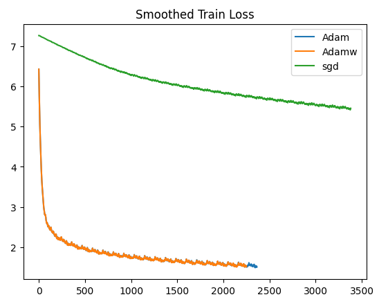

# 文本摘要实验报告

## 项目概述

介绍：本次实验任务为训练一个生成式文本摘要模型，可以通过理解文本的语义和上下文来生成新的句子或短语来概括文本。

模型： 本次实验将使用pytorch，从一个基础的基于LSTM的seq2seq模型开始搭建一个完整的训练过程(test.py)，然后在此基础上实现一个完整的transformer模型，并进行网格搜索调参，最后使用BLEU,ROUGE,METEOR指标评估模型在测试集上的表现

数据集：本次数据集为脱敏后的医疗诊断数据集，训练数据为18000条，测试数据为2000条

## 实验过程

### 一、理解seq2seq模型

#### 1. 基本结构

seq2seq模型可以用于处理序列数据，与普通的卷积神经网络不同，它的输入和输出都是一个序列，并且长度可以不一致，同时训练的模型可以记住序列信息。可以用于文本生成任务（机器翻译，文本摘要等）

在结构上，seq2seq模型由encoder和decoder结构组成，encoder负责学习输入序列特征，decoder负责结合encoder的输出以及自己的历史输出作为输入预测下一个输出。这样的结构可以让模型在输出时考虑到前文的信息

一种常见的基于RNN的seq2seq结构如下


#### 2. 输入和输出

输入序列为[\<sos\>, x1, x2, x3, \<eos\>]，输出序列为[\<sos\>, y1, y2, y3, \<eos\>]

其中\<sos\>(start of sequence)和\<eos\>标记序列的起始和终止位置来方便模型判断序列的起始和终止

在输入维度上应是训练集输入文本的单词量，同样在输出维度上应是输出文本的单词量，而模型在预测时，就是预测在各个单词上的概率值，通过softmax选择最大概率的输出从而得到预测单词

#### 3. 模型训练

模型训练的流程如下：

- 使用RNN结构（LSTM、GRU），让encoder学习输入序列的特征
- 对于decoder，同样使用RNN结构，但是对于输入，在包含encoder的输出的同时，使用教师强制（teacher forcing）的方式：
  - 初始输入为\<sos\>标记
  - 对于p的概率，使用原始的目标文本单词作为下一次输入(教师强制，很形象的比喻)
  - 对于1-p的概率，使用自己生成的单词作为下一次输入
- 直到预测到原始的目标文本的\<eos\>位置为止

### 二、处理数据集（data/data_handler.py）

#### 1. 构建词汇表

##### 1.1 处理方式

理解了seq2seq模型后，就可以处理数据集了，首先是构建词汇表映射，即将单词映射到一个索引，由于本身的数据已脱敏（即已经是数字序列），实际不用再重新映射，只需要记录数字种类，但是一方面，在常见的文本生成任务中此步骤必不可少，另一方面，需要为特殊标记预留索引，在没有完全扫描整个数据集的情况下，无法知道哪个数字未被占用，所以依然重新映射词汇表

为方便表达，对于类似于`词汇`、`单词`的表述，之后统一使用`token`代替

##### 1.2 预留标记

在本次任务中，预留了4个标记：`PAD_TOKEN = 0, SOS_TOKEN = 1, EOS_TOKEN = 2, UNK_TOKEN = 3`

其中unk标记的作用是，在测试模型时，如果出现了在训练数据中不存在的token，则标记为unk

##### 1.3 编码方式

在将文本转化为数字序列时，常用的编码方式有one-hot编码和整数编码，由于本次任务中只有数字序列，所以直接使用整数编码

##### 1.4 代码实现

定义Vocabulary类，来记录映射

```python
self.word2index = {}
self.index2word = {}
self.nums = 4  # 记录token总数
```

#### 2. 将数据集转化为data_tensor

##### 2.1 划分数据集

对于数据集来说，需要划分验证集来为后续调参提供指标，此处使用8:2的固定划分方式划分训练集和验证集

所以总的数据集比例为训练:验证:测试=14400:3600:2000

##### 2.2 填充数据

得到训练，测试，验证三个dataframe的结构后，首先分别构建源序列和目标序列的token表，仅根据训练集来构建以防信息泄漏。构建出的总token数均为1294

接着转为dataloader，而在转为dataloader前，要先将每个样本的原序列和目标序列转为pair，但是由于序列长度并不一致，为了后续能够并行化处理每一个batch的数据，需要对序列进行填充，此处有两种做法：

- 直接将整个训练集的序列填充至最大长度
- 按照每个batch中的最大长度填充

显然，第二种方法可以减少数据尺寸，提高训练速度

具体做法为：

- 将dataframe中的每个样本转为可遍历的dataset，由于torch本身的tensor函数需要保证长度一致，所以我自定义了一个IterableDataset：

```python
class MyIterableDataset(IterableDataset):
    def __iter__(self):
        ...
        yield one_source_idx, one_target_idx
```

迭代过程为对每个样本先按照词表映射到token序列，然后添加起始终止标记

- 接着按batch_size转为dataloader:

```python
loader = DataLoader(iterable_dataset, batch_size=self.batch_size, collate_fn=self._collate_fn)
```

注意此处需要传入一个整理函数，负责按batchsize的数据填充序列

- 整理函数在找到batch中的最长长度后，分别按照源序列和目标序列的最长长度填充pad_token，填充后就可以转为torch可识别的tensor

- 最后分别得到train_loader，val_loader，test_loader

### 三、RNN的搭建（model/lstm.py）

处理完数据集后，就可以来搭建RNN了。具体的做法是，先定义encoder和decoder结构，然后组合为seq2seq结构

#### 1. encoder

逻辑主要为，先将输入序列转为embedding向量，然后通过LSTM层得到输出，由于LSTM的结构，输出将包含原始embedding向量学习后的特征输出，以及记忆状态的输出：


#### 2. decoder

类似于decoder，输入序列变为了上一个预测的token/target的token，将其转为embedding向量后，连同encoder输出的hidden与cell传给LSTM层，最后通过一个全连接层转为输出维度：


#### 3. seq2seq

得到encoder和decoder后就可以定义seq2seq模型，此时还需要注意它们的hidden维度需要保持一致，另外一般来说，它们的层数也该保持一致，即n层encoder对应n层decoder：


#### 4. 训练模型(./test.py)

总共参数为8,682,766

模型训练过程和卷积神经网络的训练过程一致，只不过在定义损失函数时，我们需要忽略pad_token：`self.criterion = nn.CrossEntropyLoss(ignore_index=PAD_TOKEN)`

主要原因在于，在模型训练时，为了保持并行性，decoder对序列的预测是预测至当前batch样本中目标序列的最大长度，所以一部分的序列预测是超过eos标记的，但是我们只需要对比eos前的损失，另外，我们还需要除去第一个位置的标记。训练完成后，在验证集上测试损失。

### 四、Transformer（model/transformer.py）

至此，我们完成了从数据预处理到模型搭建和训练的完整流程。但由于LSTM本身计算量较大，并且训练结果相对较差，于是决定搭建transformer模型，可以在提高计算效率的同时获得更好的结果

由于从头开始编写transformer结构并不是容易的事，因此参考了教程：
https://github.com/bentrevett/pytorch-seq2seq/blob/master/6%20-%20Attention%20is%20All%20You%20Need.ipynb

#### 1. Attention is all you need

与传统的RNN结构不同，transformer使用了多头自注意力机制。事实证明仅仅用自注意力机制就可以捕捉序列信息。另外不同于传统RNN需要循环预测token，transfomer可以直接利用mask矩阵和attention分布来并行化预测结果，从而提高计算效率

transformer的核心是使用了多头自注意力机制，即多个自注意力机制的组合：

- 将输入的矩阵进行三次线性变换得到Q，K，V
- 计算$Q*K.T/\sqrt{d_k}$
- 在对计算结果softmax得到attention分布前，需要用mask矩阵将pad部分的计算结果置为-1e10，这样可以让softmax对pad部分的权重几乎为0,从而防止它影响权重的输出
- 最后将计算结果乘以V得到最终结果
- 多个自注意力机制之间是独立的，我们可以进行并行化计算，将矩阵维度变换至：

  ```
  Q = [batch size, n heads, query len, head dim]
  ```

  按照上述方法计算后，拼接最终的结果并经过线性层输出：

  ```python
    x = x.permute(0, 2, 1, 3).contiguous()
    # x = [batch size, query len, n heads, head dim]
    x = x.view(batch_size, -1, self.hid_dim)
    # x = [batch size, query len, hid dim]
    x = self.fc_o(x)
    # x = [batch size, query len, hid dim]
  ```

#### 2. Feed Forwad

transformer的另一个核心部件是feed forward层，可以将计算结果通过两个全连接层进行变换：


#### 3. Add and norm

在多头自注意力层和feed forward层之后，均使用了残差连接和layernorm层来归一化。残差连接用于解决深度网络退化问题，具体实现如下：

```python
_src, _ = self.self_attention(src, src, src, src_mask)
src = self.attn_layer_norm(src + self.dropout(_src))
```

#### 4. Encoder, Decoder, Seq2Seq

- 与传统的RNN不同，transformer添加了位置编码来表示序列的位置信息，论文的结构使用了固定位置编码，而对于大多数transformer变体，如BERT,则使用了可学习的位置编码，本实验也这样处理：`self.pos_embedding = nn.Embedding(max_length, hid_dim)`，其中max_length表示输入序列的最大token数,根据数据集将此值设置为150
- 定义了主要结构后，Encoder和Decoder结构则可以按照论文方式编写，另外需要实现的是mask矩阵。首先源序列和目标序列都需要mask矩阵，源序列的mask矩阵负责遮挡padding部分，而目标序列的mask矩阵需要逐层遮挡序列之后的信息，具体形式是一个下三角矩阵，此外还需要叠加对padding的mask矩阵

### 五、训练过程优化（./train.py）

定义好transformer结构后，对训练过程进行一些优化。首先一些基础设置为：使用Adam作为优化器，使用固定的学习率，使用交叉熵作为损失函数

#### 1. 添加初始权重

一个好的初始权重可以避免模型陷入局部最优点，加速模型的收敛以及改善模型的泛化能力。
权重初始化的方式有很多，此处选择最常用的Xavier均匀初始化：

```python
def initialize_weights(m):
    if hasattr(m, "weight") and m.weight.dim() > 1:
        nn.init.xavier_uniform_(m.weight.data)
```

#### 2. 选择验证损失最好的模型

之前的训练只选择了最后一次迭代的模型，但我们的目标是最小化验证集损失，于是我们记录和保存最好验证损失情况的模型：

```python
if valid_loss < best_valid_loss:
    best_valid_loss = valid_loss
    torch.save(self.model.state_dict(), model_save_path)
```

#### 3. 添加早停

为了方便之后的模型调参，我们限制最大迭代次数为30次，然后添加早停条件，即如果验证机损失如果没有小于最优损失，则计数加一，直到计数达到3，则中止训练，这样可以方便找到合适的训练步数

#### 4. 梯度裁剪

在每批次训练中，通过裁剪所有参数的梯度范数，使其不超过阈值（设置为1）来防止梯度爆炸问题：`clip_grad_norm_(self.model.parameters(), 1)`

#### 5. 调整序列输入

在原来的RNN序列中，输入的目标序列包括了EOS标记，但是在transformer中，由于mask矩阵，最后一步是输入整个目标序列，如果标记了EOS,则模型的最后一步预测输出是EOS标记后的token,这是我们并不需要的，所以在模型输入时，我们并不输入EOS标记，但是在计算损失时，EOS标记的位置仍然算作损失，来让模型学习到在合适的位置生成EOS标记

### 六、模型预测

为了方便后续对模型的评估，让模型在测试集上生成文本。

定义一个inference函数，接受输入文本，返回预测文本，预测流程如下：

- 将输入文本转化为token序列，并添加sos和eos标记，然后将序列转化为tensor
- 定义一个predict列表，用于存储预测的token，列表的第一个元素为sos标记
- 将输入文本传入encoder,得到encoder的输出
- 循环n次，n为希望生成的文本的最大长度，在实际预测中，将此值设置为参考序列的长度+10。在每次循环中：
  - 将predict列表转化为tensor, 为其生成mask矩阵，连同encoder的输出传给decoder
  - 使用decoder的输出进行softmax,得到预测token
  - 将预测token添加到predict列表，如果预测为EOS标记，则终止预测
- 将最终的predict列表中的token重新转化为原来的数字序列

可行但未实践的优化：

- 原来的实现一次只预测一个序列，但是依然可以像训练时同时预测多个序列，来加快在测试集上生成预测的速度
- 目前的实现是贪心预测，即每一步选择最有可能的token，这样容易陷入局部最优解，一种优化方式是beam search，即每一步选择top-n个可能的token

### 七、模型指标

#### 1. Perplexity

训练时指标除了损失函数以外,对于文本生成任务，还可以计算困惑度(perplexity)，它提供了对模型在预测下一个token的困难程度的估计, 定义为预测概率的几何平均值的倒数

我们可以通过为平均交叉熵损失取指数得到困惑度:`math.exp(epoch_loss)`

#### 2. 文本质量评估指标

训练完模型后，我们让模型对2000条测试数据进行预测得到预测文本，并使用BLEU,ROUGE,METEOR三个指标评估文本质量

##### 2.1 BLEU

BLEU最早是为评估机器翻译而提出，它的计算公式如下：

$$
BLEU = BP * exp(sum(wi * log(pi)))\\
BP = min(1, exp(1 - (r / c)))
$$

r是生成文本的长度，c是参考答案的长度，pi表示n-gram的精确匹配率，wi表示对应n-gram的权重。BLEU通常计算1-gram到4-gram的精确匹配率，再对其进行加权平均。

实验中使用from torchtext.data.metrics import bleu_score来提供bleu-4的计算

##### 2.2 ROUGE

ROUGE指标常见的变体有：

- ROUGE-N：衡量模型生成的n-gram与参考摘要中的n-gram的重叠程度
- ROUGE-L：计算最长公共子序列的精确匹配率

对于rouge指标来说，可以同时计算准确率，召回率和f1分数。本次实验只关注F1分数，因为它同时考虑到了准确率和召回率，具体计算公式为：

$$
Precision = (重叠的n-gram数量) / (模型生成的n-gram数量)\\
Recall = (重叠的n-gram数量) / (参考摘要中的n-gram数量)\\
F1 = 2 * (Precision * Recall) / (Precision + Recall)\\
$$

实验中使用from rouge import Rouge来提供对测试集所有rouge-l,rouge-1,rouge-2的f1值的平均值的计算

##### 2.3 METEOR

meteor指标同时考虑到了同义词匹配，词干匹配，词序，由于本身数据集是脱敏过的，所以无法评估同义词、词干的匹配，但是可以考虑到词序，计算公式如下

$$METEOR = (1 - \beta) \times \text{precision} + \beta \times \text{recall} \times \text{fragment penalty}$$

fragment penalty是一个惩罚项，用于惩罚预测结果与参考答案之间的词序差异。它的计算公式为：

$$\text{fragment penalty} = \gamma \times \text{fragment score}$$

fragment score是通过计算预测结果中的不连续匹配（例如，插入、删除或替换）的数量来得到的。

其中，$\beta$和$\gamma$是权重因子，用于平衡precision、recall和fragment penalty之间的重要性。

实验中使用from nltk.translate.meteor_score import meteor_score来提供对测试集所有meteor平均值的计算，注意使用这个包需要下载额外的wordnet语料库，虽然对于我们的数据集来说并不需要这个语料库，但是由于使用此api不得不下载

## 实验结果(kaggle.ipynb)

因为本地设备的限制，实验环境均为KAGGLE网站提供的jupyter环境，训练GPU为`GPU P100`, 实验结果均可在kaggle.ipynb的输出中查找

### 一、优化器对比(compare_optimizer.py)

固定超参数为：

`learning_rate=0.001,max_epochs=30,batch_size=128,hidden_dim=128,ff_dim=512,n_layers=2,heads=8,dropout=0.2,optimizer="adam"`

我们对比了三种优化器（adam,adamw,sgd），得到训练损失变化如下：



可见adam和adamw的训练效果差不多，sgd则表现不佳，说明对于transformer来说需要更强劲的优化器

三者在测试集上的评估指标对比如下：

|       | BLEU       | ROUGE-L    | ROUGE-1    | ROUGE-2    | METEOR     |
| ----- | ---------- | ---------- | ---------- | ---------- | ---------- |
| Adam  | **0.2410** | **0.4992** | **0.5247** | **0.3488** | **0.4518** |
| Adamw | 0.2311     | 0.4938     | 0.5192     | 0.3435     | 0.4433     |
| SGD   | 0.0        | 0.097      | 0.097      | 0.0        | 0.053      |

可见在transformer上adam优化器的表现最好，另外，transformer结构的可训练参数量仅为4,759,055，比之前实现的rnn结构少了一半，但是可以获得更好的效果

### 二、模型调参（choose_param.py）

借助于kaggle平台提供的硬件支持，减小了我们调参的时间成本。本次调参空间如下：

```python
param_grid = {
    "learning_rate": [0.001, 0.0005, 0.0001], "hidden_dim": [128, 256],
    "ff_dim": [512, 1024], "n_layers": [2, 4], "dropout": [0.2, 0.5],
}
```

其余固定参数为，optimizer=adam，batch_size=128，max_epochs=30, heads=8

参数空间大小为48，进行网格调参，在经历了6h的训练后，我们根据在验证集上的最佳损失，获得了最佳超参数如下：

`{'learning_rate': 0.0005, 'hidden_dim': 256, 'ff_dim': 1024, 'n_layers': 2, 'dropout': 0.2}`

早停的训练步数为15步

其余所有的参数组合结果（在验证集上的损失、在测试集上的生成指标）均可在output/choose_param.json中查看，平均的早停迭代次数在20步

最佳参数在测试集上的损失与PPL为：

`loss=1.845, ppl=6.325`

在测试集上的生成指标为：

|            | BLEU   | ROUGE-L | ROUGE-1 | ROUGE-2 | METEOR |
| ---------- | ------ | ------- | ------- | ------- | ------ |
| best_model | 0.2783 | 0.5357  | 0.5614  | 0.3872  | 0.4918 |

从结果上我们可以发现一个问题，在验证集上的损失越低，在测试集上的评估指标就会越好吗？通过查看所有参数组合的结果，可以发现事实并非如此（最好的bleu指标可以达到0.2962），主要问题在于两个数据集并不相等，而我们只能根据验证集来挑选模型，因此仍选择这样的参数

尽管如此，在指标上仍可以看出模型的训练结果较好，其中BLEU指标与transformer论文模型在各个数据集上的表现相当

rouge指标说明生成的文本对参考文本的覆盖率和精准度都较好

meteor指标额外引入词序的检查，说明词序也较为合适

在训练集和验证集上的收敛情况：


使用此模型为测试集生成的所有结果保存在output/result.csv中

## 总结与体会

### 1. 困难总结

- 处理数据集时，如何将长度不同的序列组成dataloader（使用自定义的IterableDataset）
- 转换为dataloader时，如何对数据进行padding（使用自定义的collate函数）
- 计算交叉熵损失时，要避免对padding标记的计算（设置ignore_index）
- 评估指标时，得到的BLEU偏低（进行文本生成时，设置的max_len太小，重新设置为参考文本的长度+10）
- 本地设备训练的时间成本太高（利用kaggle提供的jupyter环境训练）

### 2. 知识与心得

本次实验首先搭建了基于lstm的seq2seq模型，了解了seq2seq模型的整个训练流程，之后从头实现了transformer模型，对多头自注意力机制，mask矩阵，残差连接等实现有了更深刻的了解，以及自注意力机制与循环网络的区别。最后用多个指标对模型进行评估，了解到了各指标的计算方式与区别

另外，本次实验使用kaggle平台提供的硬件，减少了调参时间成本，也体会到了训练模型时调参的成本之高，以及对算力的要求
